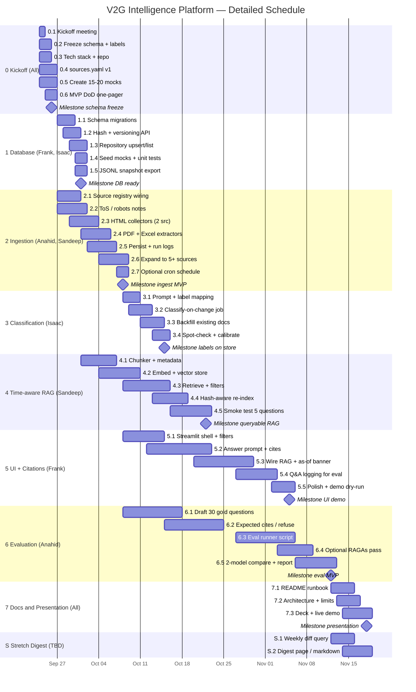

# V2G Intelligence Platform — Detailed Gantt Chart

**Team:** Anahid, Sandeep, Frank, Isaac · **Fuse Capstone** · **Sep 24 – Nov 18, 2026**

Visual chart: [`V2G_Gantt_Detailed.png`](V2G_Gantt_Detailed.png) · Interactive HTML: [`V2G_Gantt_Detailed.html`](V2G_Gantt_Detailed.html) · Regenerate: `python docs/generate_gantt.py`

---

## Milestones

| Date | Milestone |
|------|-----------|
| Sep 26 | Kickoff done — schema, sources, mocks frozen |
| Oct 1 | Database + versioning ready |
| Oct 8 | Ingest MVP (≥5 sources) |
| Oct 15 | Classification labels on store |
| Oct 22 | Time-aware RAG queryable |
| Nov 5 | Streamlit UI + citations demo |
| Nov 12 | Evaluation report (MVP) |
| Nov 18 | Documentation + presentation |

---

## Mermaid Gantt (GitHub / Notion preview)



---

## Subtask table (owners + windows)

| ID | Subtask | Owner | Start | End | Depends on |
|----|---------|-------|-------|-----|------------|
| 0.1 | Kickoff meeting | All | Sep 24 | Sep 24 | — |
| 0.2 | Freeze schema + label enums | All | Sep 24 | Sep 25 | — |
| 0.3 | Tech stack + repo layout | All | Sep 24 | Sep 25 | — |
| 0.4 | `sources.yaml` v1 (5–8 sources) | Anahid, Sandeep | Sep 24 | Sep 26 | — |
| 0.5 | 15–20 mock documents | All | Sep 24 | Sep 26 | 0.2 |
| 0.6 | MVP definition-of-done | All | Sep 25 | Sep 26 | 0.2 |
| 1.1 | Schema migrations | Frank, Isaac | Sep 27 | Sep 29 | 0.2 |
| 1.2 | Content hash + versioning | Frank, Isaac | Sep 28 | Sep 30 | 1.1 |
| 1.3 | Repository upsert/list/get | Frank | Sep 29 | Oct 1 | 1.1 |
| 1.4 | Seed mocks + unit tests | Isaac | Sep 30 | Oct 1 | 0.5, 1.3 |
| 1.5 | JSONL snapshot export | Frank | Sep 30 | Oct 1 | 1.3 |
| 2.1 | Source registry wiring | Anahid | Sep 27 | Sep 30 | 0.4 |
| 2.2 | ToS / robots access notes | Anahid | Sep 27 | Oct 1 | 0.4 |
| 2.3 | HTML collectors (first 2) | Sandeep | Sep 29 | Oct 3 | 2.1 |
| 2.4 | PDF + Excel extractors | Sandeep | Oct 1 | Oct 5 | 2.3 |
| 2.5 | Persist via DB + run logs | Anahid, Sandeep | Oct 2 | Oct 6 | 1.3, 2.4 |
| 2.6 | Expand to ≥5 sources + CLI | Anahid | Oct 4 | Oct 8 | 2.5 |
| 2.7 | Optional cron schedule | Anahid | Oct 7 | Oct 8 | 2.6 |
| 3.1 | Classification prompt | Isaac | Oct 8 | Oct 10 | 1.1 |
| 3.2 | Classify-on-change job | Isaac | Oct 9 | Oct 12 | 1.2, 3.1 |
| 3.3 | Backfill labels | Isaac | Oct 11 | Oct 14 | 2.5, 3.2 |
| 3.4 | Spot-check + calibrate | Isaac | Oct 13 | Oct 15 | 3.3 |
| 4.1 | Chunker + chunk metadata | Sandeep | Oct 1 | Oct 6 | 1.4 |
| 4.2 | Embeddings + vector store | Sandeep | Oct 4 | Oct 10 | 4.1 |
| 4.3 | Retrieve API + filters | Sandeep | Oct 8 | Oct 15 | 4.2 |
| 4.4 | Hash-aware re-index | Sandeep | Oct 13 | Oct 18 | 1.2, 4.3 |
| 4.5 | Smoke test 5 questions | Sandeep | Oct 16 | Oct 22 | 2.6, 4.4 |
| 5.1 | Streamlit shell + filters | Frank | Oct 8 | Oct 14 | 0.5 |
| 5.2 | Answer prompt + citations | Frank | Oct 12 | Oct 22 | 5.1 |
| 5.3 | Wire RAG + as-of banner | Frank | Oct 20 | Oct 29 | 4.3, 5.2 |
| 5.4 | Q&A logging for eval | Frank | Oct 27 | Nov 2 | 5.3 |
| 5.5 | Polish + demo dry-run | Frank | Nov 2 | Nov 5 | 5.3 |
| 6.1 | Draft ~30 gold questions | Anahid | Oct 8 | Oct 17 | 0.5 |
| 6.2 | Expected cites / refuse notes | Anahid | Oct 15 | Oct 24 | 6.1 |
| 6.3 | Eval runner (accuracy + cites) | Anahid | Oct 27 | Nov 5 | 5.3, 6.2 |
| 6.4 | Optional RAGAs scorecard | Anahid | Nov 3 | Nov 8 | 6.3 |
| 6.5 | 2-model compare + report | Anahid | Nov 6 | Nov 12 | 6.3 |
| 7.1 | README runbook | All | Nov 12 | Nov 15 | 1–6 |
| 7.2 | Architecture + limitations | All | Nov 13 | Nov 16 | 7.1 |
| 7.3 | Deck + presentation | All | Nov 14 | Nov 18 | 7.2 |
| S.1 | Weekly diff query | TBD | Nov 12 | Nov 15 | 1.2 |
| S.2 | Digest generation page | TBD | Nov 14 | Nov 18 | S.1, 5.3 |

---

## Parallelism (critical path sketch)

```
Task 0 ──┬── Task 1 ──┬── Task 3 ─────────────────────────┐
         │            └── Task 4 (mocks→real) ── Task 5 ──┼── Task 6 ── Task 7
         └── Task 2 ──────────────┘                       │
                                                          └── Stretch (optional)
```

**Critical path (protect these):**  
`0 → 1 → 4 → 5 → 6 → 7`  
Ingestion (2) and classification (3) run beside RAG/UI so collectors do not block the assistant demo.

---

## Workload by person (approx. calendar span)

| Person | Primary bars | Peak weeks |
|--------|--------------|------------|
| **Frank** | DB (with Isaac), UI 5.1–5.5, docs | Sep 27–Oct 1 · Oct 8–Nov 5 |
| **Isaac** | DB (with Frank), classification 3.1–3.4, docs | Sep 27–Oct 1 · Oct 8–15 |
| **Sandeep** | Ingest extractors, RAG 4.1–4.5, docs | Sep 29–Oct 22 |
| **Anahid** | Registry/schedule, eval 6.1–6.5, docs | Sep 27–Oct 8 · Oct 8–Nov 12 |

---

*Aligned with `V2G_Project_Plan_Detailed.md` and the team task plan (start Sep 24, 2026).*
